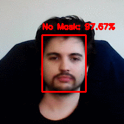

# Assignments for Lecture 8
This assignment is from lecture 8 of the OMTP course. The assignment is about using CNN's and deep learning to create a mask detector. The output of the mask detection can be seen on the gifs below. 

## Assignment - Vivian

## Assignment - Giorgio

## Assignment - Daniela

