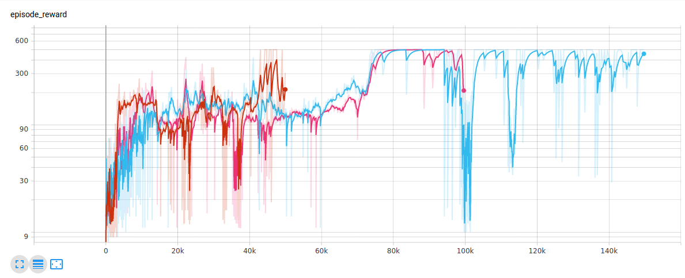
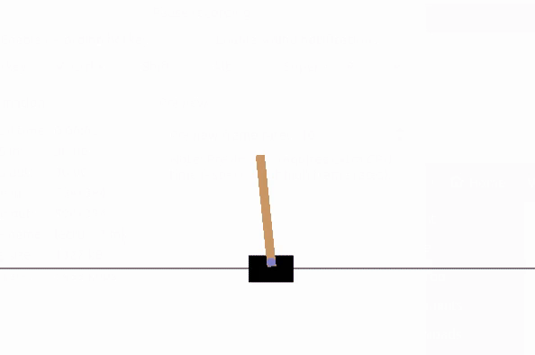
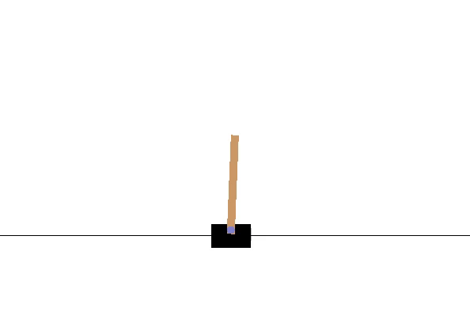
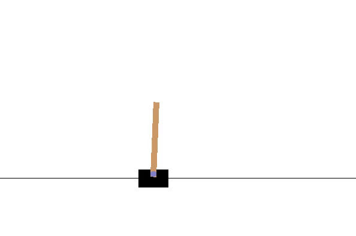

# Assignment for Lecture 9
This assignment is from lecture 9 of the OMTP course. The assignment is about using reinforcement learning (DQN method) to train a model to balance a pole. This assignment is done by training the model with DQN for different timesteps (50000, 100000 and 150000). The trained models are then tested to see if it is able to balance the pole. 


## Description
Make Python >=3.5 virtual environment called "env" (can be changed):
```
virtualenv -p python3 env
```

Install OpenAI gym, follow:
```
https://github.com/openai/gym#installation3.
```

Install tensorflow+tensorboard<=1.15.04, follow:
```
https://www.tensorflow.org/install/pip
```

Install Stable-Baselines, follow:
```
https://stable-baselines.readthedocs.io/en/master/guide/install.html5.
```

Train the model:
```
Run assignment1.py
set train_model = True
```

Test the model:
```
Run assignment1.py 
set train_model = False
```

Observe the training with TensorBoard
```
tensorboard --logdir ./logs
```
## Graph




### GIF for timesteps: 50000


### GIF for timesteps: 100000


### GIF for timesteps: 150000



